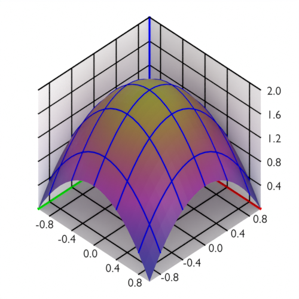

# genpyblender

Create 3D plots with python and blender. Part of the [generativepy project](https://github.com/martinmcbride/generativepy).

Still under development. Feel free to give it a try, but be aware that it is currently not documented, may contain bugs, and the interface might change in the future.

Uses code and techniques from [blender-cli-rendering](https://github.com/yuki-koyama/blender-cli-rendering) and [blender_mathematics](https://github.com/crazyBaboon/blender_mathematics).
